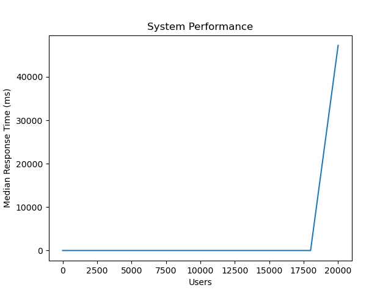

# Financial Stock Analysis

## Overview :
The application is designed to analyze the stock price of a share by utilizing datasets from past 20 years and using live stock market data.

The link to the application : [App](https://definalproj.azurewebsites.net/)

The link to the video describing the repository : [Video](https://www.youtube.com/watch?v=hJKhQFhQiTI)

This repository contains a `Flask App` which is also hosted on `Azure` for public access. The project makes use of `Delta Tables` from `Databricks`,  a docker image hosted on `DockerHub` and utilizes `Azure Web App` for deployment. Further, the project uses various `APIs` to interact with external websites for getting data to make predictions. 

The App can be run by the user locally or can be accessed via the link provided earlier.
The following image represents the `architectural diagram` of our project :

## Functioning of the App :

### Home Page : 
This is the landing page of our application which takes two inputs : 
1. The stock that needs to be predicted.
2. The email where the prediction needs to be sent. 

### Output  of the Application: 
The following are the functions of our application:

#### 1. Stock Price Prediction
Information and Predictions of the stock price
  

#### 2. News Articles relevant to the stock : 
Latest articles to make an informed decision before buying a stock
  

#### 3. Time Series Plot   : 
Provides The historical data trends in a candle chart for visual analysis of the stock

#### 4. Personalized Stock Prediction Mail Service : 
Personalized Prediction mail

## Instructions to Setup
A. Online: Visit the Link provided earlier and no additional steps are required. 

Note: The web app may not be available in case the Azure service is shut due to exhaustion of credits, please use the offline method mentioned below if the Web app is not available.

B. Offline:

1. Clone This repository to your local machine.

2. Perform a `make install` to install all the required packages and libraries

3. Enter the following command into the Terminal:
`python app.py`

4. click on the Links which are shown in the terminal

6. When done using the app, press CTRL+C to quit the app

## Microservice

-   The application is designed around a specific business capability - fetching data from an API and providing real-time and historical stock analysis. This aligns with the principle of single responsibility in microservices architecture.
-   The application is designed to be deployed as a containerized application. A Docker Image is available on Dockerhub for the same. This aligns with the principle of infrastructure automation in microservices architecture.
-   The application has its own data pipeline, storing data in a Delta Lake in Azure Workspace. This aligns with the principle of decentralized data management in microservices architecture.

## Load Test
-   The application is designed to manage a high volume of requests. Load testing was performed using Locust, and the results demonstrated that the application can effectively handle up to 10,000 concurrent users. The maximum response time recorded during this load test was 70,000 milliseconds (or 70 seconds). These results underscore the application's adherence to the principle of elasticity in a microservices architecture, as it can scale to accommodate significant traffic and maintain functionality under heavy load.

## Data Engineering
This application is designed for robust data engineering tasks leveraging a variety of tools:

- `Pandas for Data Analysis:` Utilizes Pandas for comprehensive data analysis tasks within a Python environment.

- `PySpark for Data Wrangling:` Leverages PySpark to efficiently manipulate and transform large-scale datasets.

- `Spark SQL for Data Querying and ETL:` Employs Spark SQL for streamlined data querying and performing Extract, Transform, Load (ETL) operations on diverse datasets.

- `Delta Lake for Data Storage:` Utilizes Delta Lake for reliable and scalable data storage, ensuring ACID transactions and versioning for data integrity.

This combination of tools offers a powerful suite for managing, analyzing, and processing data at scale, enabling efficient data engineering workflows.

## Infrastructure as Code (IaC)
Infrastructure as Code (IaC) is a practice in which the infrastructure setup is written in code files, rather than manually configured. These code files can be version-controlled and reviewed, allowing for easy changes and rapid disaster recovery.

Here's how this project satisfies the Infrastructure as Code requirement:

`Dockerization:` We have containerized the application using Docker. The Dockerfile serves as a form of Infrastructure as Code, as it automates the process of setting up the application environment.

`Hosting on Azure ACR:` We have used Azure Resource Manager (ARM) templates scripts to automate the deployment of your Docker containers to Azure ACR, this is also a form of Infrastructure as Code.

`Data Pipeline Setup:` The setup of the data pipeline (from API to Delta Lake in Azure Workspaces) is automated using Azure Workflows that are scheduled to run daily, this is another example of Infrastructure as Code.

## Quantitative Assessment
-    The load test results are available in the `results` folder. The system performance showed that the median response time increased after ~ 18,000 users

## Contents 

Files in this repository include:

## 1. Readme
  The `README.md` file is a markdown file that contains basic information about the repository, what files it contains, and how to consume them

## 2. Requirements
  The `requirements.txt` file has a list of packages to be installed for runnning the project. 

## 3. Codes
  This folder contains all the code files used in this repository - the files named "Test_" will be used for testing and the remaining will define certain functions

## 4. Templates
This folder contains the HTML templates which will be used by the Flask Application. 
  1. stock_prediction.html - an HTML File containing the landing page view for the app
  2. email_sent.html - an HTML File containing the view for when the email is sent to the user

## 5. CI/CD Automation Files

  ### 5(a). Makefile
  The `Makefile` contains instructions for installing packages (specified in `requirements.txt`), formatting the code (using black formatting), testing the code (running all the sample python code files starting with the term *'Check...'* ), and linting the code using pylint

  ### 5(b). Github Actions
Github actions are used to automate the following processes whenever a change is made to the files in the repository:

`install :` installs the packages and libraries mentioned in the requirements.txt

`test :` uses pytest to test the python script

`format :` uses black to format the python files

`lint :` uses ruff to lint the python files

Note -if all the processes run successfully the following output will be visible in github actions:

  ### 5(c). Devcontainer
  
  The `.devcontainer` folder mainly contains two files - 
  * `Dockerfile` defines the environment variables - essentially it ensures that all collaborators using the repository are working on the same environment to avoid conflicts and version mismatch issues
  * `devcontainer.json` is a json file that specifies the environment variables including the installed extensions in the virtual environment

## 6. Data
Contains CSV and Parquet files used for initial loads and fast acccess

## 7. resources
contains additonal files which are used in the README

## 8. Dockerfile:
This is the dockerfile which contains intructions for the Dockerimage construction, this is for the app and is different from the dockerfile present in the .devcontainer folder

## Team Members
Divya Sharma (ds655)

Revanth Chowdary Ganga (rg361)

Udyan Sachdev (us26)

Ayush Gupta (ag758)

`Teamwork Reflection` : Please find the teamwork reflection in the [teamwork](teamwork) folder in this repository. 
